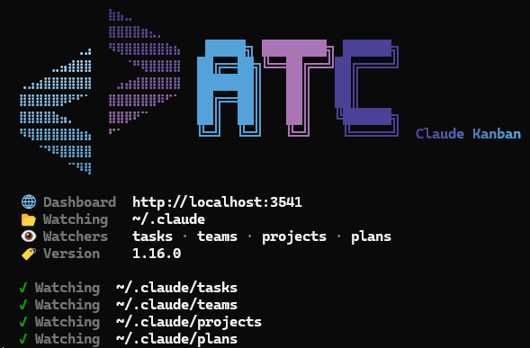
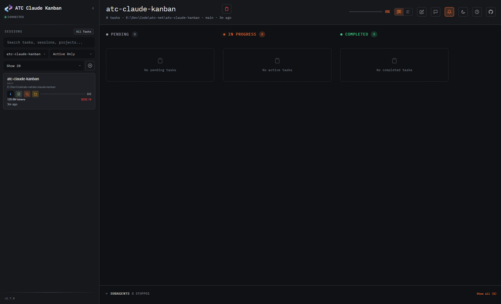
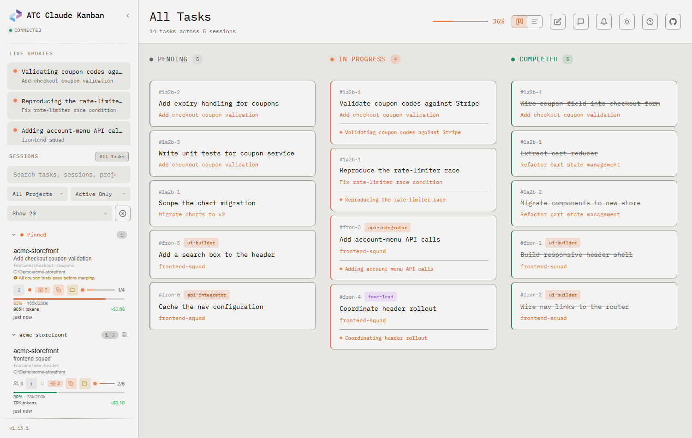

# Atc.Claude.Kanban

Real-time Kanban dashboard for monitoring [Claude Code](https://docs.anthropic.com/en/docs/claude-code) agent tasks, sessions, and subagents through a browser-based board.

<p align="center">
  
</p>

<p align="center">
  
</p>

<p align="center">
  
</p>

- 📊 **Real-time Kanban board** — tasks flow through Pending → In Progress → Completed as Claude works
- 📈 **Timeline view** — horizontal bar chart showing task durations, colored by status, with hover tooltips
- 🔔 **Desktop notifications** — browser notifications + sound chime when tasks complete
- 📦 **Auto-archive** — stale sessions (>7 days, no active tasks) collapse into an "Archived" section
- 🤖 **Agent team support** — color-coded team members, owner filtering, member badges
- 🧩 **Subagent visibility** — see active subagents with agent descriptions, names, and copy-to-clipboard prompts
- 🔗 **Task dependencies** — visual blockedBy/blocks relationships with smart badge clearing
- 📡 **Server-Sent Events** — instant updates via file watching, no polling
- 💬 **Session message log** — view conversation transcript (user/assistant/tool calls) in a side panel
- 🎯 **Activity status** — thinking/waiting/idle/error indicators per session, derived from JSONL
- 💰 **Token & cost tracking** — accumulated token usage and model-aware cost per session
- 🖱️ **Drag-drop** — reorder tasks between kanban columns by dragging
- 📓 **Scratchpad** — per-session quick notes with localStorage persistence
- 🔧 **Open in editor** — click file paths in the message log to open in VS Code
- ⌨️ **Keyboard navigation** — vim-style (hjkl) + arrow keys, sidebar/board focus toggling
- 🌙 **Dark/light themes** — system preference detection
- 🔍 **Fuzzy search** — across sessions, tasks, descriptions, and project paths
- 📝 **Plan viewer** — view and open Claude Code plans with Mermaid.js diagram rendering
- 🔌 **Auto-port discovery** — automatically finds an available port when the default is taken
- 🔄 **Auto-update** — checks NuGet for new versions on startup and updates automatically
- 🚫 **Session dismiss** — temporarily hide sessions from the active list without deleting them
- ⚡ **Smart polling** — skips polling when the browser tab is hidden, catches up on focus

## 📋 Requirements

- [.NET 10 SDK](https://dotnet.microsoft.com/download) (or later, via RollForward)

## 🚀 Getting Started

### Install

```powershell
dotnet tool install -g atc-claude-kanban
```

### Run

```powershell
# Start the dashboard (default: http://localhost:3456)
atc-claude-kanban

# Start and open browser automatically
atc-claude-kanban --open

# Custom port (fails fast if port is unavailable)
atc-claude-kanban --port 8080

# Custom Claude directory
atc-claude-kanban --dir ~/.claude-work

# Skip the NuGet update check on startup
atc-claude-kanban --no-update-check
```

Then open your browser to `http://localhost:3456` and watch your Claude Code tasks in real time.

> **Auto-port:** When using the default port and it's already in use, the tool automatically tries up to 10 consecutive ports (3456, 3457, ...). When `--port` is specified explicitly, the tool fails fast.

## ✨ Features

### 📊 Kanban Board

Three-column board showing task status with live updates:

| Column | Description |
|--------|-------------|
| **Pending** | Tasks waiting to start |
| **In Progress** | Tasks Claude is actively working on (pulsing indicator) |
| **Completed** | Finished tasks |

### 📈 Timeline View

Toggle between Kanban and Timeline views using the view toggle buttons in the header:

- Horizontal bars show each task's duration from creation to last update
- Color-coded by status: gray (pending), orange with glow (in-progress), green (completed)
- Hover tooltips show task name, status, duration, and start time
- Click any bar to open the task detail panel
- Time axis adapts to data range (seconds/minutes/hours/days)
- View preference persists across page reloads

### 🔔 Desktop Notifications

Click the bell icon in the header to enable browser notifications:

- Fires when a task transitions from **in_progress** to **completed**
- Includes a two-tone audio chime (synthesized via Web Audio API — no audio files)
- Click the notification to focus the window and open the completed task
- Preference saved in localStorage

### 📦 Auto-Archive

Sessions older than 7 days with no in-progress tasks are automatically archived:

- Archived sessions appear in a collapsible "Archived (N)" section at the bottom of the sidebar
- Dimmed to 50% opacity for visual distinction
- Expand/collapse state persists across page reloads
- Hidden during search or when filtering to active sessions

### 🤖 Agent Teams

When Claude Code spawns agent teams, the dashboard shows:
- Color-coded owner badges per team member
- Owner filtering dropdown
- Team info modal with member details
- Task counts per agent

### 🧩 Subagents

When Claude Code spawns subagents via the Task tool, the dashboard shows:
- Active subagent count badge in the sidebar (only when subagents are running)
- Collapsible subagent panel below Kanban columns with status dots, model info, and descriptions
- Agent names and short descriptions extracted from the parent session's Agent tool_use blocks
- Foreground agent correlation via `toolUseResult` entries
- Copy button on task prompts and expandable/scrollable detail view
- "Show all" toggle to view historical subagents (default: active only)
- Parsed from JSONL transcript files at `~/.claude/projects/{hash}/{sessionId}/subagents/`

### 💬 Session Message Log

Toggle with the chat icon in the toolbar or `Shift+L`:

- View the conversation transcript (user prompts, assistant responses, tool calls)
- Tool parameter badges and expandable tool results
- Read tool calls show inline offset/limit annotations (e.g., `L45 +30`)
- Clickable file paths open in VS Code
- Subagent log drill-in (click agent tool calls to view subagent conversation)
- Infinite scroll with pagination for long conversations
- Resizable panel (drag the left edge)

### ℹ️ Session Info

Click the info button on any session to view detailed metadata:

- Session ID, project path, git branch, and description
- Working directory (CWD) shown when it differs from the project root
- Plan viewer, copy path, and open folder actions
- **Dismiss button** — temporarily hide a session from the active list (in-memory only, restores on reload or in "All" view)

### 🎯 Activity Status

Sessions show real-time activity indicators in the sidebar:

| Status | Indicator | Condition |
|--------|-----------|-----------|
| **Thinking** | Green border | Claude is actively working (tool calls, processing) |
| **Waiting** | Amber border | Claude is waiting for user input (permission prompt) |
| **Error** | Red border | Recent error in session |
| **Idle** | No indicator | No activity for 15+ seconds |

### 💰 Token & Cost Tracking

Each session shows accumulated token usage and estimated cost:

- Token count (e.g., "45.9M tokens") and cost (e.g., "$76.19")
- Color-coded by cost: green (<$0.50), yellow (<$2), orange (<$5), red (>=$5)
- Model-aware pricing: Opus ($15/$75), Sonnet ($3/$15), Haiku ($0.80/$4) per 1M tokens

### ⌨️ Keyboard Shortcuts

| Key | Action |
|-----|--------|
| `?` | Show help |
| `j`/`k` | Navigate up/down |
| `h`/`l` | Navigate columns |
| `Enter` | Toggle task detail |
| `Tab` | Switch sidebar/board focus |
| `[` | Toggle sidebar |
| `T` | Toggle theme |
| `A` | Show all tasks |
| `R` | Refresh data |
| `I` | Session info |
| `P` | Open session plan |
| `C` | Copy project path |
| `F` | Open project folder |
| `D` | Delete task |
| `Shift+L` | Toggle message log panel |
| `N` | Toggle scratchpad |

### 📡 How It Works

```
Claude Code writes task JSON files
        ↓
FileSystemWatcher detects changes
        ↓
Debounce + parse + cache (IMemoryCache)
        ↓
Broadcast via Server-Sent Events
        ↓
Browser updates Kanban board in real-time
```

The tool watches these paths under `~/.claude/`:

| Path | Content |
|------|---------|
| `tasks/{sessionId}/*.json` | Individual task files |
| `teams/{teamName}/config.json` | Team configurations |
| `projects/{hash}/sessions-index.json` | Session metadata |
| `projects/{hash}/{sessionId}/subagents/agent-*.jsonl` | Subagent transcripts |
| `plans/{slug}.md` | Plan markdown files |

## 📂 Claude Code Directory Structure

The dashboard reads from `~/.claude/`, where Claude Code stores all session data:

```
~/.claude/
├── tasks/                              ← PRIMARY: task files (what the Kanban reads)
│   ├── {sessionId}/*.json              ← Session-scoped tasks (UUID)
│   └── {teamName}/*.json               ← Team-scoped tasks (named)
│
├── teams/                              ← Team configurations (agent swarms)
│   └── {teamName}/config.json          ← Members, roles, lead agent
│
├── projects/                           ← Session metadata (enrichment)
│   └── {path-hash}/
│       ├── sessions-index.json         ← Session list with project path, git branch
│       ├── {sessionId}.jsonl           ← Session transcript (one JSON object per line)
│       └── {sessionId}/subagents/      ← Subagent transcripts
│
└── plans/                              ← Plan markdown files
    └── {slug}.md
```

**JSON vs JSONL**: Task files, team configs, and session indexes are standard `.json` (single object). Session transcripts are `.jsonl` (JSON Lines — one JSON object per line, append-only). The dashboard only reads `.json` files; `.jsonl` transcripts are used for metadata discovery (project path, git branch).

**Session discovery**: Sessions appear on the board if they have task `.json` files under `tasks/`, or if they have active subagents under `projects/`. The `projects/` and `teams/` directories enrich sessions with metadata (project name, git branch, team members).

## ⚙️ Environment Variables

| Variable | Description |
|----------|-------------|
| `ATC_NO_UPDATE_CHECK=1` | Disable the NuGet update check on startup |

The update check is also automatically suppressed in CI environments (`CI`, `TF_BUILD`, or `GITHUB_ACTIONS` env vars detected).

## 🏗️ Architecture

- **ASP.NET Core Minimal APIs** with `Atc.Rest.MinimalApi` endpoint definitions
- **FileSystemWatcher** + `System.Threading.Channels` for event-driven file monitoring
- **Server-Sent Events** via `Results.Stream` with raw UTF-8 byte writes and `Task.Delay` heartbeats
- **Async service layer** — all file I/O uses `ReadAllTextAsync`/`WriteAllTextAsync`
- **IMemoryCache** with TTL expiration (10s sessions, 5s teams)
- **Embedded static files** — single HTML dashboard served via `ManifestEmbeddedFileProvider`
- **Smart polling** — skips activity polls when browser tab is hidden; catches up on focus
- **Selective fetching** — metadata SSE events skip task list fetching for reduced API overhead

## 🤝 How to contribute

[Contribution Guidelines](https://atc-net.github.io/introduction/about-atc#how-to-contribute)

[Coding Guidelines](https://atc-net.github.io/introduction/about-atc#coding-guidelines)
